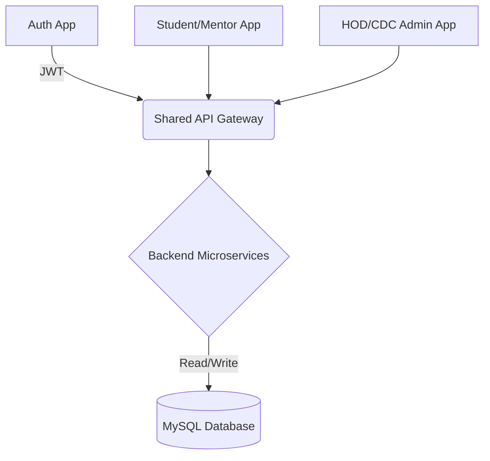

<div align="center">
  
  
  # ProjectFlow Edu 🚀
  
  **The AI-Powered Academic Project Lifecycle Management Platform**

  [](https://reactjs.org/)
  [](https://nodejs.org/)
  [](https://www.mysql.com/)
  [](https://tailwindcss.com/)
  [](https://vitejs.dev/)

  *Transforming basic student projects into a professional, Jira-inspired Agile workflow.*
</div>

---

## 📖 Project Overview

**ProjectFlow Edu** is a comprehensive, SaaS-grade platform designed for a **single-college deployment**. It bridges the gap between academic submissions and industry-standard agile workflows. By organizing the chaos of final-year projects, it provides a centralized hub where students collaborate, mentors evaluate, HODs oversee, and placement cells (CDC) scout top talent.

### The Four Pillars of ProjectFlow:
1. **👨‍🎓 Students**: Form teams, manage tasks via Kanban, collaborate on documents, and submit final repositories.
2. **👨‍🏫 Mentors**: Track team progress, review code/documents, and evaluate contributions using a strict rubric.
3. **🏛️ HOD (Head of Department)**: Maintain global oversight, track late submissions, and enforce department-wide templates.
4. **🏢 CDC (Career Development Cell)**: Discover high-value, hackathon-ready projects and track startup incubation metrics.

---

# Why ProjectFlow Edu vs Existing Tools?

**Jira-inspired, but purpose-built for academic institutions.**

| Feature | ProjectFlow Edu | Jira | Trello | Asana | Microsoft Teams | GitHub Classroom | LMS/ERP |
| :--- | :---: | :---: | :---: | :---: | :---: | :---: | :---: |
| **Kanban Workflow** | ✅ | ✅ | ✅ | ✅ | Limited | Limited | ❌ |
| **Internal Chat** | ✅ | Limited | ❌ | Limited | ✅ | ❌ | Limited |
| **Academic Grading** | ✅ | ❌ | ❌ | ❌ | ❌ | Partial | ✅ |
| **Mentor Review Workflow** | ✅ | ❌ | ❌ | ❌ | ❌ | Partial | Partial |
| **HOD Dashboard** | ✅ | ❌ | ❌ | ❌ | ❌ | ❌ | Partial |
| **CDC / Innovation Portal** | ✅ | ❌ | ❌ | ❌ | ❌ | ❌ | ❌ |
| **GitHub Tracking** | ✅ | Plugin | ❌ | ❌ | ❌ | ✅ | ❌ |
| **Startup Pipeline Support** | ✅ | ❌ | ❌ | ❌ | ❌ | ❌ | ❌ |
| **Team Collaboration** | ✅ | ✅ | Limited | ✅ | ✅ | Limited | Limited |
| **Contribution-Based Marks** | ✅ | ❌ | ❌ | ❌ | ❌ | ❌ | Partial |
| **Timeliness Scoring** | ✅ | ❌ | ❌ | ❌ | ❌ | ❌ | ❌ |
| **Document Workspace** | ✅ | Plugin | ❌ | Limited | ❌ | ❌ | Partial |
| **Multi-Role Academic Workflow** | ✅ | ❌ | ❌ | ❌ | ❌ | ❌ | Partial |

ProjectFlow Edu is not a generic project management tool. It is a college-focused academic SaaS platform combining project execution, mentorship, grading, collaboration, innovation tracking, and startup readiness.

---

## ✨ Core Features by Role

### 👨‍🎓 Student Portal
- **Team Collaboration**: Form teams (max 5 members) with defined roles (Leader, Frontend, Backend, etc.).
- **SDLC Kanban Board**: Manage tasks through To Do, In Progress, Testing, and Done.
- **Document Workspace**: Access mentor-assigned templates and submit reports in a distraction-free, full-screen editor placeholder.
- **Final Submission Hub**: Submit GitHub repository links with automated validation and demo URLs.
- **Contribution Tracking**: Real-time visibility into individual task completion and expected marks.

### 👨‍🏫 Mentor Portal
- **Project Review Hub**: Accept or reject incoming project proposals.
- **Document Templates**: Distribute standard templates (SRS, Architecture, PPT) to assigned teams.
- **Submission Reviews**: Track version history, approve documents, or return them with "Needs Work" remarks.
- **Contribution Evaluation**: Score individual student performance using the standardized 100-mark rubric.

### 🏛️ HOD Portal
- **Department Analytics**: Visualize project distribution across tech domains (AI/ML, Web, IoT).
- **Template Management**: Create standard departmental templates inherited by mentors.
- **Submission Tracking**: Identify bottlenecks and filter teams by "Late Submissions".
- **Mentor Oversight**: Track mentor performance and student ratings.

### 🏢 CDC Portal
- **Innovation Tracking**: Monitor active academic startups and industry collaborations.
- **Hackathon Visibility**: Identify "Hackathon-Ready" projects based on high mentor/innovation scores.
- **Showcase Projects**: Direct access to top-tier student GitHub repositories and live demos.

---

## 💎 Advanced SaaS Features

ProjectFlow goes beyond a standard CRUD app by implementing modern SaaS UI/UX paradigms:
- 🔔 **Real-time Notification Center**: Grouped alerts (Today/Yesterday) with unread badging.
- ⏱️ **Activity Timeline**: Centralized event tracking (e.g., "Task Moved to Testing", "Draft Uploaded").
- 💬 **Internal Project Chat**: A dual-channel (Team & Mentor) chat interface, fully structured for real-time Socket.io integration.
- 📅 **Calendar Planner**: Custom CSS-grid month/week planner for deadlines and syncs.
- 📊 **Analytics Dashboards**: Interactive charts powered by `Recharts`.
- 🔐 **Role-Based Access Control (RBAC)**: Strict route protection preventing cross-role data leaks.

---

## 🎯 Standardized Marks System (100 Marks Total)

To ensure fair evaluation, the platform strictly enforces the following automated & manual rubric:

| Criteria | Max Marks | Evaluator | Description |
| :--- | :---: | :--- | :--- |
| **Work Contribution** | 50 | Mentor (Manual) | Overall code quality, effort, and team participation. |
| **Task Completion** | 20 | System (Auto) | Calculated dynamically via Kanban: `(Completed / Assigned) * 20` |
| **Timeliness** | 15 | System (Auto) | Punctuality of phase submissions (5/5 to 1/5 scale converted to 15 points). |
| **Documentation** | 10 | Mentor (Manual) | Quality of SRS, Architecture, and Final Reports. |
| **GitHub Submission** | 5 | System (Auto) | Valid public repository link provided upon final submission. |

---

## 🏗️ Technical Architecture

### Tech Stack
- **Frontend**: React 18, Vite, Tailwind CSS v4, shadcn/ui, Recharts, Lucide-React.
- **Backend**: Node.js, Express.js.
- **Database**: MySQL (Relational mappings for Users, Teams, Projects, Tasks, Submissions).
- **Authentication**: JWT (JSON Web Tokens) with HttpOnly cookies.
- **Storage/File Handling**: Multer (Prepared for local/S3 uploads).
- **Real-time**: Socket.io (Architecture-ready).
- **API Client**: Axios with centralized interceptors.

### 📂 Folder Structure

```text
ProjectFlow/
├── frontend/
│   ├── src/
│   │   ├── components/      # Reusable UI (Buttons, Modals, StatCards)
│   │   ├── context/         # React Context (AuthContext)
│   │   ├── layouts/         # DashboardLayout, AuthLayout
│   │   ├── lib/             # Axios instance setup
│   │   ├── pages/           # Role-based views
│   │   │   ├── auth/        # Login, Register
│   │   │   ├── student/     # Kanban, Workspace, Chat, Calendar
│   │   │   ├── mentor/      # Evaluations, Reviews
│   │   │   ├── hod/         # Analytics, Tracking
│   │   │   └── cdc/         # Innovation Hub
│   │   └── App.jsx          # Route configurations & RBAC
├── backend/
│   ├── src/
│   │   ├── config/          # DB & Environment configs
│   │   ├── controllers/     # Route logic
│   │   ├── middlewares/     # Auth, Error handlers
│   │   ├── models/          # MySQL Queries/Schemas
│   │   └── routes/          # API endpoint definitions
│   └── server.js            # Express entry point
└── README.md
```

### 🧩 Microservice-Style Frontend Architecture

ProjectFlow Edu embraces a microservice-inspired frontend topology to ensure massive scalability and absolute role isolation. Instead of a monolithic client, the application logic is segmented into distinct "Apps" routed seamlessly under a unified shell.

- **Auth App**: Handles all unified access points including Student/Mentor/HOD/CDC Login, Student Signup, and Forgot Password flows.
- **Student/Mentor Portal App**: The core academic engine handling the Student Dashboard, Projects, SDLC Kanban, Document Workspace, Contribution Analytics, Calendar, Chat, Notifications, and Mentor Reviews.
- **HOD/CDC Admin App**: The executive oversight layer handling HOD/CDC Dashboards, Department Analytics, Submission Tracking, Innovation/Startup Monitoring, and Master Template Management.

#### Architectural Benefits:
- **Independent Deployment**: Segments can be isolated and scaled based on role traffic.
- **Cleaner Separation of Concerns**: Strict boundary between student-facing tools and administrative oversight.
- **Role Isolation**: Absolute security preventing unauthorized routing or data leaks between roles.
- **Enterprise SaaS Readiness**: Built from day one to handle multi-tenant, large-scale university deployments.



### 🌐 Microservice-Style Deployment Strategy

Designed for future production-scale academic SaaS environments, ProjectFlow is fully cloud and Docker-ready.

**Frontend:**
- Auth Frontend Server
- Student/Mentor Frontend Server
- HOD/CDC Frontend Server

**Backend Infrastructure:**
- Node.js API Services
- Dedicated JWT Auth Service
- Document / Storage Service (Multer/S3)
- Real-time Notification & Chat Services (Socket.io)

**Infrastructure Edge:**
- Nginx Reverse Proxy for routing traffic to respective micro-frontends.
- Docker-ready containerized deployment patterns.
- Cloud-agnostic (AWS/GCP) scalability.

---

## 🚀 Installation & Setup

### Prerequisites
- Node.js (v18+)
- MySQL Server (v8+)

### 1. Clone the repository
```bash
git clone https://github.com/Piyush200516/ProjectFlow.git
cd ProjectFlow
```

### 2. Environment Setup
Create a `.env` file in the `backend/` directory:
```env
PORT=5000
NODE_ENV=development

# MySQL Database Credentials
DB_HOST=localhost
DB_USER=root
DB_PASSWORD=your_password
DB_NAME=projectflow

# JWT Secrets
JWT_SECRET=your_super_secret_jwt_key
JWT_EXPIRES_IN=24h
```

### 3. Install Dependencies
**Backend:**
```bash
cd backend
npm install
```

**Frontend:**
```bash
cd ../frontend
npm install
```

### 4. Run the Application
Start both servers concurrently (or in separate terminals):

**Terminal 1 (Backend):**
```bash
cd backend
npm run dev
```

**Terminal 2 (Frontend):**
```bash
cd frontend
npm run dev
```

The application will be available at `http://localhost:5173`.

---

## 🗺️ Frontend Routes

- `/login` - Unified authentication entry point.
- `/register` - Student team registration.
- `/student/*` - Dashboard, Kanban, Chat, Document Workspace, Final Submission.
- `/mentor/*` - Review Requests, Document Tracking, Contribution Evaluation.
- `/hod/*` - Global Analytics, Master Templates, Late Tracking.
- `/cdc/*` - Startups, Hackathons, Industry Partnerships.

---

## 🔌 Backend API Modules (v1)

- **`/api/auth`**: Login, Registration, JWT validation.
- **`/api/projects`**: CRUD operations for academic projects.
- **`/api/teams`**: Team formation and role assignments.
- **`/api/tasks`**: Kanban board state management.
- **`/api/documents`**: File uploads and version tracking.
- **`/api/evaluations`**: Mentor scoring and marks calculation.

---

## 🔮 Future Roadmap

- [ ] **OnlyOffice / Collabora Integration**: Replace the document workspace placeholder with a fully functional, self-hosted collaborative document editor.
- [ ] **Real-time Socket.io**: Hook up the Chat UI and Activity Timeline to push events in real-time.
- [ ] **AI Mentor Assistant (LLM)**: Automated code reviews and initial proposal evaluations.
- [ ] **Plagiarism Detection**: Web scraping and cross-project text similarity checks.
- [ ] **RAG Knowledge Base**: Let students chat with department guidelines and previous years' project reports.

---

## 📸 Screenshots

> *Note: Add high-resolution screenshots of the deployed application here.*

| Student Kanban Board | Mentor Evaluation Dashboard |
| :---: | :---: |
|  |  |

| Document Workspace | HOD Analytics |
| :---: | :---: |
|  |  |

---

<div align="center">
  Built with ❤️ by <b>Piyush Mishra</b>
</div>