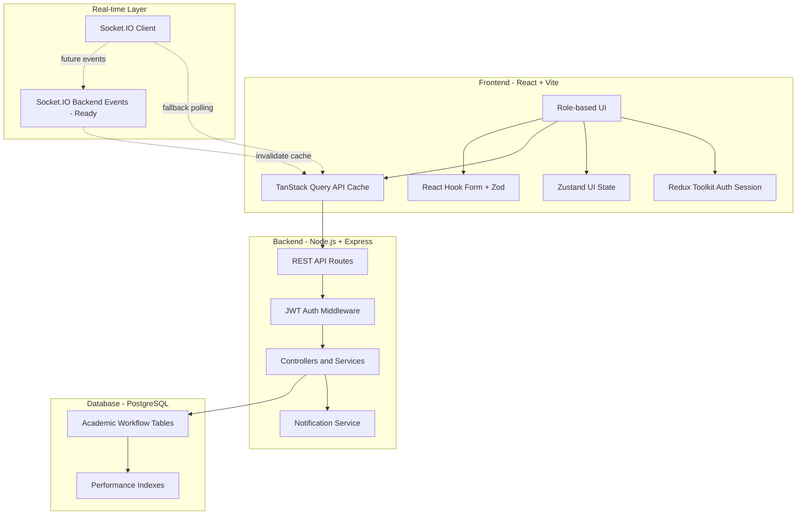

<p align="center">
  
</p>

<h1 align="center">ProjectFlow Edu</h1>

<p align="center">
  <strong>AI-Powered Academic Project Management Platform</strong>
</p>

<p align="center">
  
  
  
  
  
  
</p>

---

## Project Overview

**ProjectFlow Edu** is an AI-powered academic project workflow automation platform for engineering colleges. It converts the traditional offline student project lifecycle into a structured, transparent, and fully digital workflow for students, mentors, and Heads of Department.

The platform is designed for academic project registration, team formation, HOD approval, mentor assignment, milestone tracking, document submission, review, marks tracking, and departmental visibility.

### Core Workflow

```mermaid
flowchart LR
  A["HOD creates registration form"] --> B["Students receive notifications"]
  B --> C["Students create team and register project"]
  C --> D["HOD approves or rejects"]
  D --> E["Mentor gets assigned"]
  E --> F["Timeline and milestones are created"]
  F --> G["Students submit documents"]
  G --> H["Mentor reviews submissions"]
  H --> I["Marks and progress are tracked"]
```



---

## Problem Statement

Most engineering colleges still manage student project workflows using paper forms, spreadsheets, messaging groups, and manual approval chains. This creates avoidable delays and poor visibility across departments.

Common offline workflow issues include:

- Manual project registration forms
- No centralized tracking
- Delayed approvals and mentor assignment
- No real-time student notifications
- Poor mentor-student coordination
- Document submission delays
- Limited transparency for HODs and departments
- Difficulty tracking project progress, reviews, and marks

ProjectFlow Edu solves these problems with a role-based digital project workflow built on React, Node.js, Express, and PostgreSQL.

---

## Features Implemented

### Auth

- ✅ Student signup and login
- ✅ Mentor login
- ✅ HOD login
- ✅ Role-based authentication
- ✅ JWT-based protected sessions
- ✅ Role-based frontend routing

### Student

- ✅ Profile settings
- ✅ Semester update
- ✅ View active HOD registration forms
- ✅ Fill project registration form
- ✅ Team creation
- ✅ Duplicate email and roll number validation
- ✅ Team member validation against registered students
- ✅ Notifications
- ✅ Timeline view
- ✅ Dashboard
- ✅ Document submission workflow foundation

### HOD

- ✅ Create registration form
- ✅ Publish form
- ✅ Send matching student notifications
- ✅ View registration submissions
- ✅ Approve or reject submissions
- ✅ Assign mentor
- ✅ Create project timeline
- ✅ Dashboard statistics
- ✅ Department project and student views

### Mentor

- ✅ Mentor login
- ✅ View assigned teams and projects
- ✅ Review workflow foundation
- ✅ Document review routes
- ✅ Milestone and template workflow foundation

### System

- ✅ PostgreSQL integration
- ✅ Notifications system
- ✅ Protected backend APIs
- ✅ Protected frontend routes
- ✅ Role-based routing
- ✅ Frontend architecture upgraded with modern state, query, validation, table, realtime, analytics, and monitoring libraries

---

## In Progress / Remaining Work

- 🚧 Real-time Socket.IO integration verification with production backend events
- 🚧 Mentor feedback workflow completion and polishing
- 🚧 Marks automation and scoring rules
- 🚧 Report export polishing
- 🚧 Analytics dashboard polishing
- 🚧 Document upload final verification across all roles
- 🚧 Production deployment stabilization
- 🚧 AI feature implementation and model integration

---

## Tech Stack

### Frontend

- React.js
- Vite
- Tailwind CSS
- Redux Toolkit
- React Redux
- Zustand
- TanStack Query / React Query
- React Hook Form
- Zod
- TanStack Table
- TanStack Virtual
- Socket.IO Client
- Apache ECharts
- ECharts for React
- Framer Motion
- Fuse.js
- Axios
- React Router DOM
- Lucide React

### Backend

- Node.js
- Express.js
- JWT
- bcrypt
- PostgreSQL
- pg
- Socket.IO-ready architecture
- Express Rate Limit
- CORS
- dotenv

### Database

- PostgreSQL

### Monitoring

- Sentry, enabled through `VITE_SENTRY_DSN`

---

## Architecture

ProjectFlow Edu follows a role-based full-stack architecture.



### Frontend Architecture

- Redux Toolkit stores global auth/session state: `user`, `token`, `role`, and permissions.
- Zustand stores lightweight UI state such as sidebar collapsed state, notification panel state, selected form, selected project, and modal state.
- TanStack Query handles server state caching, retries, loading state, and polling fallback.
- React Hook Form and Zod provide structured validation.
- TanStack Table and Virtual provide scalable table foundations.
- Socket.IO Client is wired for realtime readiness with polling fallback.
- Sentry captures runtime and API failures when configured.

### Backend Architecture

- Express REST APIs with role-protected routes.
- JWT authentication middleware.
- PostgreSQL queries through `pg`.
- Transaction usage in critical workflows such as project registration and team creation.
- Notification utilities for batch notification creation.

### Database Architecture

- PostgreSQL relational schema.
- Indexed workflow tables for faster lookups.
- Team validation and one-active-team rules separated from payload duplicate validation.

### Real-time Layer

- Socket.IO Client is installed and wired.
- Frontend cache invalidation is ready for notification, timeline, mentor feedback, form publish, and submission status events.
- Polling fallback remains active until backend realtime events are finalized.

---

## Database Modules

Core PostgreSQL modules include:

- `users`
- `students`
- `registration_forms`
- `project_registrations`
- `project_team_members`
- `project_milestones`
- `milestone_submissions`
- `notifications`
- `mentor_assignments`
- `mentor_reviews`
- `project_scores`
- `activity_logs`

Additional workflow tables may exist for compatibility and active modules, including project members, document submissions, tasks, forms, and timeline-related records.

---

## Folder Structure

```text
ProjectFlow/
├── backend/
│   ├── src/
│   │   ├── config/
│   │   ├── controllers/
│   │   ├── middleware/
│   │   ├── routes/
│   │   ├── utils/
│   │   ├── app.js
│   │   └── server.js
│   ├── scripts/
│   ├── uploads/
│   └── package.json
├── database/
│   ├── performance_indexes.sql
│   └── *.sql
├── frontend/
│   ├── src/
│   │   ├── assets/
│   │   ├── components/
│   │   ├── context/
│   │   ├── hooks/
│   │   ├── layouts/
│   │   ├── lib/
│   │   ├── pages/
│   │   ├── store/
│   │   ├── App.jsx
│   │   └── main.jsx
│   └── package.json
└── README.md
```

---

## Installation

### Prerequisites

- Node.js
- npm
- PostgreSQL
- Git

### Backend

```bash
cd backend
npm install
npm run dev
```

Backend runs on:

```text
http://localhost:5000
```

Health check:

```text
http://localhost:5000/api/health
```

### Frontend

```bash
cd frontend
npm install
npm run dev
```

Frontend runs on:

```text
http://localhost:5173
```

or:

```text
http://127.0.0.1:5173
```

---

## Environment Variables

### Backend `.env`

```env
PORT=5000
DATABASE_URL= databases URL
JWT_SECRET=your_jwt_secret
```

Optional local PostgreSQL variables may also be used depending on setup:

```env
DB_HOST=localhost
DB_PORT=5432
DB_USER=postgres
DB_PASSWORD=your_password
DB_NAME=projectflow_edu
```

### Frontend `.env`

```env
VITE_API_URL=http://localhost:5000/api
VITE_SENTRY_DSN=
```

Sentry is disabled automatically when `VITE_SENTRY_DSN` is empty.

---

## Performance Optimizations

- React Query caching for server state
- Polling fallback for notifications and realtime-ready features
- TanStack Table foundation for large tables
- TanStack Virtual integration for scalable table rendering
- Fuse.js fuzzy search for client-side searching
- Indexed PostgreSQL queries for project, student, notification, form, and milestone lookups
- Efficient O(n) duplicate validation using `Set`
- Batch notification insertion for matching students
- Selective API columns instead of broad production `SELECT *` patterns where optimized
- Transactions for critical registration and assignment workflows

---

## Security

- JWT authentication
- bcrypt password hashing
- Protected backend APIs
- Role-based access control
- Protected frontend routes
- Input validation with Zod on the frontend
- Parameterized PostgreSQL queries
- CORS configuration for localhost and approved origins
- Rate-limit middleware support
- Sentry-based runtime/API error monitoring when configured

---

## Deployment

### Frontend

- Target: Vercel
- Current priority: localhost-first verification

### Backend

- Current: localhost
- Future target: Render or equivalent Node.js hosting

### Database

- Current: local PostgreSQL
- Future target: managed PostgreSQL if production deployment is required

No Firebase and no CDC are used in the current architecture.

---

## Future Scope

Planned AI-powered enhancements:

- AI mentor suggestions based on project domain and faculty expertise
- AI project recommendations for students
- Plagiarism and similarity checks for submitted documents
- Predictive project progress analytics
- Smart deadline reminders
- AI-generated review summaries
- Intelligent risk detection for delayed teams
- Automated rubric-based evaluation assistance

---

## Contributor

**Piyush Mishra**

---

## License

This project is licensed under the **MIT License**.

---

<p align="center">
  <strong>ProjectFlow Edu</strong><br />
  Built to modernize academic project workflows for engineering colleges.
</p>
