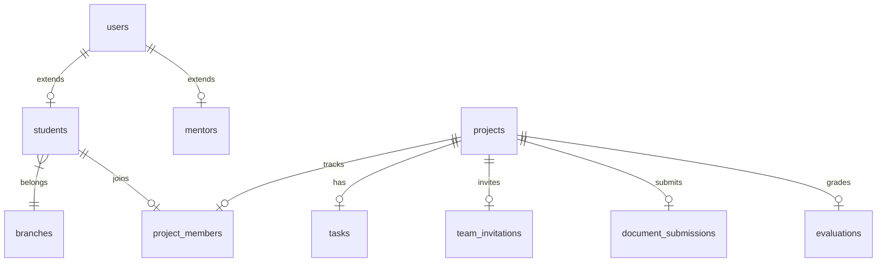

<div align="center">
  
  
  # ProjectFlow Edu 🚀
  
  **The AI-Powered Academic Project Lifecycle & Collaborative SaaS Platform**

  [](https://reactjs.org/)
  [](https://nodejs.org/)
  [](https://www.postgresql.org/)
  [](https://tailwindcss.com/)
  [](https://vitejs.dev/)
  [](https://vercel.com/)

  *Transforming unstructured college final-year project timelines into an industry-grade Agile SDLC workflow.*
</div>

---

## 📖 Project Overview

**ProjectFlow Edu** is a comprehensive, multi-role SaaS-grade platform designed for an enterprise **single-college deployment**. It bridges the gap between academic submissions and professional agile methodologies. By organizing the chaos of final-year engineering projects, it provides a unified hub where students collaborate, mentors evaluate, HODs oversee, and career development teams (CDC) scout top-tier talent.

### The Four Pillars of ProjectFlow:
1. **👨‍🎓 Students**: Form teams, invite peers, manage progress via Kanban, collaborate on deliverables, and submit GitHub repositories.
2. **👨‍🏫 Mentors**: Issue templates, review document iterations, and evaluate individual contributions using an integrated grading rubric.
3. **🏛️ HOD (Head of Department)**: Maintain global oversight, monitor late submissions, and enforce department-wide standard templates.
4. **🏢 CDC (Career Development Cell)**: Discover innovation metrics, track startup ideas, and select "hackathon-ready" projects.

---

## 🏛️ Enterprise Multi-Portal Architecture

ProjectFlow Edu employs a **decoupled microservices-style frontend topology** to enforce rigorous role isolation, robust security boundaries, and massive scalability:

```text
                  ┌─────────────────────────────────┐
                  │         College Firewall        │
                  └────────────────┬────────────────┘
                                   │
                     [ Vercel Edge Server Routers ]
                       (TLS/SSL Edge Termination)
                                   │
         ┌─────────────────────────┼─────────────────────────┐
         ▼                         ▼                         ▼
  ┌───────────────┐         ┌───────────────┐         ┌───────────────┐
  │   Auth App    │         │ Student/Mentor│         │ HOD/CDC Admin │
  │  (Port 3000)  │         │  (Port 3001)  │         │  (Port 3002)  │
  └───────────────┘         └───────────────┘         └───────────────┘
  projectflow-auth          projectflow-portal       projectflow-admin
         │                         │                         │
         └─────────────────────────┼─────────────────────────┘
                                   │
                    ┌──────────────▼──────────────┐
                    │    Vercel Serverless/Render │
                    │    Central API Gateway      │
                    └──────────────┬──────────────┘
                             (Express.js)
                                   │
         ┌─────────────────────────┴─────────────────────────┐
         ▼                                                   ▼
  ┌───────────────┐                                   ┌───────────────┐
  │   Express     │ ◄───────────[ Redis ]───────────► │   Socket.io   │
  │  API Gateway  │       (Job Queues & Cache)        │  Server (5001)│
  └───────┬───────┘                                   └───────────────┘
          │
          ▼
  ┌──────────────────────────────────────────────────────────────────┐
  │              PostgreSQL Cloud Database (Neon / Pool)             │
  └──────────────────────────────────────────────────────────────────┘
```

### Decoupled Micro-App Portals:
* 🔑 **Auth App (`projectflow-auth`)**: Unified identity provider mapping logins for all roles, student registration, and forgot-password flows.
* 🎓 **Student & Mentor Portal (`projectflow-portal`)**: The operational hub hosting student team workspaces, tasks, document version controls, chats, calendar reviews, and mentor evaluation.
* 🏛️ **HOD & CDC Admin Portal (`projectflow-admin`)**: Executive dashboards visualizing department analytics, templates management, startup funnels, and approvals.

---

## ⚡ Key SaaS Workflows Implemented

### 1. Peer-to-Peer Team Invitation Center
* **Direct Invite**: Team leaders can invite students using their **Email + Roll Number**.
* **Safety Assertions**: The system validates that the target student exists, has the `'student'` role, and is not already associated with an active project.
* **Auto-Rejection & Sync**: Accepting an invitation automatically cancels all other pending invitations for that student and hooks them up to the team's shared workspace.
* **Team Limit**: Strictly enforces a maximum of **5 members per project** using native database constraints and triggers.

### 2. Full-Lifecycle Document Workspace
* **Template Inheritance**: Mentors can publish standard SRS, architectural, or research templates.
* **Deliverable Tracking**: Phase-based document assignments with real-time submission triggers.
* **Version-Control Ledgers**: Tracks document modifications and edits via a complete historical revision rollback ledger.
* **GitHub Integration**: Validates public repository links securely before accepting final submissions.

### 3. Continuous Marks & Analytics System
* **Continuous Rubrics**: Standardized 100-mark scoring system tracking contribution weight, task completions, timelines, and documentation.
* **Student Contribution Analytics**: Charts showing progress vs expected marks powered by `Recharts`.
* **HOD Analytics**: Global oversight into project distributions, technology stack popularity, and late-submission flags.
* **CDC Incubation Funnel**: Visualizes startup stages, funding statuses, and industry partnerships.

---

## 🎯 Standardized Academic Rubric (100 Marks)

| Evaluation Rubric | Max Marks | Evaluator | Description |
| :--- | :---: | :--- | :--- |
| **Work Contribution** | 50 | Mentor (Manual) | Overall code quality, architecture patterns, and effort. |
| **Task Completion** | 20 | System (Automatic) | Calculated dynamically via Kanban completions: `(Done / Total) * 20` |
| **Timeliness** | 15 | System (Automatic) | Dynamic scoring based on phase deadlines and late trigger logs. |
| **Documentation** | 10 | Mentor (Manual) | Quality and structural review of SRS, Research draft, and PPT. |
| **GitHub Validation** | 5 | System (Automatic) | Awarded upon verification of active public repository structure. |

---

## 💾 Relational Database Schema (PostgreSQL)

The platform is powered by a robust **PostgreSQL** schema composed of **25 highly indexed, constraint-enforced tables**:



### Table Dictionary:
* **Academic Context**: `departments`, `branches`
* **Identities & Access**: `users`, `students`, `mentors`
* **Workspace & Teams**: `projects`, `project_members`, `team_invitations` *(Invites)*, `notifications`
* **SDLC Kanban**: `sdlc_stages`, `tasks`, `milestones`
* **Document Control**: `document_templates`, `document_assignments`, `document_submissions`, `document_versions` *(Revision Rollback Ledger)*, `final_submissions`
* **Oversight & Approvals**: `mentor_feedback`, `evaluations`, `approvals`
* **Incubation & Utilities**: `chat_messages`, `activity_logs`, `calendar_events`, `hackathons`, `startups` *(incubation status)*, `industry_collaborations`

---

## ⚙️ Tech Stack & Deployed URLs

### Technical Stack
* **Frontend**: React 18, Vite, Tailwind CSS v4, shadcn/ui, Recharts, Lucide Icons.
* **Backend**: Node.js, Express.js (Modular Router & Controller layers).
* **Database**: PostgreSQL (SSL connection pools ready for Neon Serverless).
* **Middlewares**: JWT auth cookies, Rate Limiting, Helmet Security.

### 🌐 Live Production Deployments

* 🔑 **Auth App Gateway**: [https://projectflow-auth.vercel.app](https://projectflow-auth.vercel.app)
* 🎓 **Student & Mentor Portal**: [https://projectflow-portal.vercel.app](https://projectflow-portal.vercel.app)
* 🏛️ **HOD & CDC Admin Portal**: [https://projectflow-admin.vercel.app](https://projectflow-admin.vercel.app)
* 📡 **Express Backend API**: [https://projectflow-backend.vercel.app](https://projectflow-backend.vercel.app)
  * *Health Check:* `/api/health` ➡️ [https://projectflow-backend.vercel.app/api/health](https://projectflow-backend.vercel.app/api/health)

---

## 🚀 Installation & Local Development

### 1. Clone & Set Up the Backend
```bash
git clone https://github.com/Piyush200516/ProjectFlow.git
cd ProjectFlow/backend
npm install
```

Create a `.env` file in the `backend/` directory:
```env
PORT=5000
NODE_ENV=development
DB_HOST=localhost
DB_PORT=5432
DB_USER=postgres
DB_PASSWORD=root
DB_NAME=projectflow_edu
JWT_SECRET=your_super_secret_jwt_key
JWT_EXPIRES_IN=24h
```

Start the local server:
```bash
npm run dev
```

### 2. Set Up the Frontend
```bash
cd ../frontend
npm install
npm run dev
```
The portals will be accessible locally at `http://localhost:5173`.

---

## 🔮 Future Roadmap

- [ ] **OnlyOffice / Collabora Integration**: Embed a real-time, self-hosted document co-authoring engine directly inside the Workspace.
- [ ] **AI-Powered Document Quality Reviews**: LLM integration to grade SRS and Architecture documents based on compliance checklists.
- [ ] **Plagiarism Checker**: Cross-project code and documentation similarity parsing.
- [ ] **GitHub Webhook Analytics**: Automate contribution mapping by reading actual Git commit metrics and code additions/deletions.
- [ ] **AI Mentor Assistant**: Automatic technical bottleneck alerts and task assignment suggestion engine.
- [ ] **SMS / WhatsApp Alerts**: Real-time push alerts for deadline milestones and review delays.

---

<div align="center">
  Built with ❤️ by <b>Piyush Mishra</b>
</div>