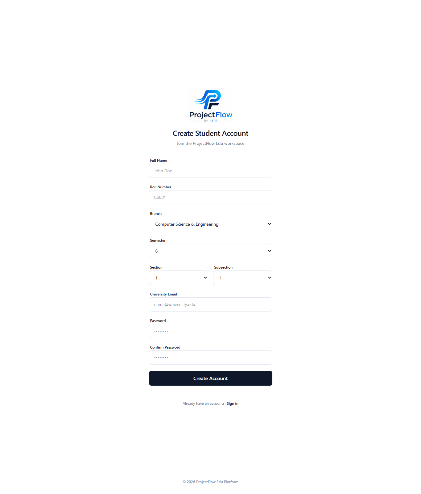
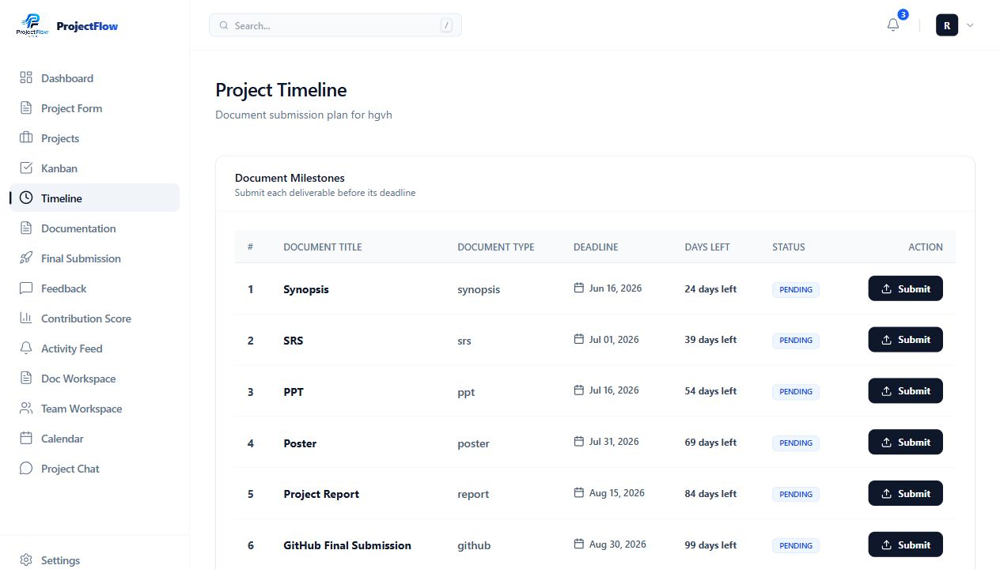

<p align="center">
  
</p>

<h1 align="center">ProjectFlow</h1>

<p align="center">
  <strong>AI-powered campus project management platform for students, mentors, HODs, admins, and super admins.</strong>
</p>

<p align="center">
  <a href="https://project-flow-blush.vercel.app"></a>
  
  
  
  
  
  <br />
  
  
  
  
  
  
</p>

## Live Deployment

- **Frontend Live URL:** https://project-flow-blush.vercel.app
- **Backend API URL:** https://project-flow-ed3n.vercel.app/api
- **Current production host:** Vercel
- **Enterprise API foundation:** `/api/v2/*`

## Overview

ProjectFlow digitizes the complete campus project lifecycle: student account creation, project registration, team formation, HOD registration forms, approvals, mentor assignment, milestone tracking, document workflows, notifications, analytics, and real-time collaboration readiness.

The repository currently contains the active production React/Vite application plus a new enterprise-grade Next.js App Router workspace that is being built phase by phase.

## 🚀 Latest Updates (Last 24 Hours)

> **Last Updated:** May 28, 2026 (05:58 AM IST)

### New Features Added
- **Real Forgot Password Flow**: Integrated Nodemailer in the backend (`backend/src/utils/emailService.js`) to support real email reset flow, complete with secure hashed token storage and a 30-minute token expiration limit.
- **Enterprise Workspace Initialization**: Set up the Next.js App Router project structure (`next-app/`) configured with shadcn/ui components, custom state store (Zustand), and React Query integration.
- **Student Dashboard Compatibility**: Implemented new endpoint dashboard route mappings for student statistics data compatible with local and production deployment databases.
- **Form Publish Visibility Control**: Added server-side checks and migrations for registration forms, ensuring students can only access forms that have been published and are active.

### UI/UX Improvements
- **Tailwind v4 Styling Pipeline Restored**: Restored Tailwind CSS building pipeline in the React Vite frontend, correcting imports inside `frontend/src/index.css` and configuring `tailwind.config.cjs` and `postcss.config.cjs`.
- **Responsive Auth Forms**: Verified and restored fully responsive signup and login layouts for Student, HOD, and Mentor routes.
- **Next.js Enterprise Components**: Constructed initial UI library using Radix UI primitives and Class Variance Authority in `next-app/src/components/ui/` featuring button, card, input, badge, and switch elements with light/dark theme toggle support.

### Backend/API Changes
- **Vercel Serverless Deployment**: Adapted Express server backend to execute in the Vercel serverless environment.
- **Express Version Adjustments**: Downgraded backend Express dependency to `v4.22.2` to resolve serverless request body-parsing constraints.
- **CORS Configuration**: Restructured Express CORS middleware to permit credentials, handle preflight options, and explicitly whitelist the production URL `https://project-flow-blush.vercel.app`.
- **Dynamic Frontend API Base URL**: Added dynamic detection of the production base path vs local host in frontend client requests to support transparent proxying.

### Database Changes
- **Database Schema Migrations**:
  - Restored student semester validation to range strictly between semesters 5-8 (`20260527_restrict_student_semesters.sql`).
  - Added dashboard status compatibility schemas (`20260527_dashboard_route_compat.sql`).
  - Added registration form visibility rules table fields (`20260527_registration_form_publish_visibility.sql`).
- **Postgres Seeding Fixes**: Corrected seeding user and role IDs mismatched in SQL script `database/projectflow_edu_postgres_schema.sql`.

### Authentication Updates
- **Email Normalization**: Standardized all authentication routes (login, register, forgot-password) to sanitize and lowercase emails, preventing login mismatches due to capitalization.
- **HOD Login Alignment**: Patched credential mapping and validation within the backend authentication controllers for HOD role login requests.
- **HOD User Management Scripting**: Introduced helper management and credentials scripts (`check-hod.js`, `hod-upsert.js`, `manage-hod.js`, `scripts/update_hod_credentials.js`) to manage administrative personnel entries directly in postgres tables.

### Deployment Changes
- **Proxy and Routing Rule Configuration**: Added `netlify.toml` containing explicit redirects rules mapping `/api/*` requests to the Netlify functions base directory `/api.js`.
- **Rate-Limiter IP Resolution**: Optimized express-rate-limit to extract the real remote client IP address from the Netlify header `x-nf-client-connection-ip`.

### Bug Fixes
- Fixed student registration form draft visibility so students cannot view or register for unpublished HOD forms.
- Fixed case-sensitive email login block by standardizing normalization to lowercase in database queries.
- Corrected database seed constraints referencing primary user IDs.
- Restored broken CSS/Tailwind compiled output path configurations on the client.
- Fixed backend HOD authentication status checks.

### Performance Optimizations
- Implemented client IP resolution middleware for rate limiter optimization under serverless environments.
- Optimized database query response payloads for dashboard status tracking.

### New Technologies/Libraries Added
- **Backend**: `serverless-http` (v4.0.0) for running serverless endpoints on Netlify.
- **Enterprise Workspace**: `next` (v16.2.6), `react` (v19.2.4), `tailwindcss` (v4.2.1), `lucide-react` (v1.16.0), `radix-ui` (v1.4.3), `zustand` (v5.0.13), `@tanstack/react-query` (v5.100.14), `framer-motion` (v12.40.0).

### Pending Work / Next Steps
- Migrate dashboard, project registration, and HOD forms features into the Next.js App Router workspace (`next-app/`).
- Connect and configure production-grade Redis (Upstash) in live settings.
- Implement production SMTP settings for the forgot password flow inside Netlify environment dashboard configuration.

---

## Core Features & Capabilities

- **Role-Based Access**: Dedicated student, mentor, HOD, and administrative workspaces.
- **HOD Registration Forms**: Creation, publication, and workflow controls for custom project forms.
- **Student Project Registration**: Complete validation logic for semesters, team member emails, and registration numbers.
- **Mentorship Mapping**: HOD-driven approval process with automatic and manual mentor allocation.
- **Real-Time Collaboration**: Express Socket.IO connection rooms mapped to active student-mentor projects.
- **Enterprise Foundations**: Prisma 7 database schemas, `/api/v2/auth` security middleware, session caching, and admin audit logging.

## Tech Stack

### Active Frontend

- **React**: `^19.2.6`
- **Vite**: `^8.0.12`
- **Tailwind CSS**: `^4.3.0`
- **React Router**: `^7.15.1`
- **Redux Toolkit**: `^2.12.0`
- **Zustand**: `^5.0.13`
- **TanStack React Query**: `^5.100.14`
- **TanStack Table**: `^8.21.3`
- **React Hook Form**: `^7.76.1`
- **Zod**: `^4.4.3`
- **Framer Motion**: `^12.40.0`
- **ECharts for React**: `^3.0.6` & **echarts**: `^6.1.0`
- **Socket.IO Client**: `^4.8.3`
- **Sentry-ready monitoring**: `@sentry/react ^10.53.1`

### Enterprise Frontend Foundation

- **Next.js**: `^16.2.6` (App Router)
- **Tailwind CSS**: `^4.2.1`
- **shadcn**: `^4.7.0` (UI primitives)
- **Framer Motion**: `^12.40.0`
- **TanStack Table**: `^8.21.3`
- **React Query**: `^5.100.14`
- **Zustand**: `^5.0.13`
- **Socket.IO Client**: `^4.8.3`
- **React DnD**: `^16.0.1`
- **Recharts**: `^3.8.1`

### Backend

- **Node.js**: `20+`
- **Express.js**: `^4.22.2` (Downgraded for serverless compatibility)
- **Prisma Client**: `^7.8.0`
- **Serverless HTTP**: `^4.0.0` (Netlify integration)
- **Socket.IO**: `^4.8.3`
- **JWT**: `jsonwebtoken ^9.0.3` & `bcryptjs ^3.0.3`
- **Nodemailer**: `^8.0.9` (Password reset / mail flows)
- **Express Rate Limit**: `^8.5.2`
- **Redis Integration**: `ioredis ^5.10.1` & `bullmq ^5.76.8`
- **Database Driver**: `pg ^8.20.0` & `mysql2 ^3.22.3`

### Database

- **PostgreSQL**: Managed via Neon-compatible connection strings
- **Prisma ORM**: Schema defined in `backend/prisma/schema.prisma`
- **Compatibility**: Legacy migrations and SQL schemas structured in `database/`

## Authentication & Security

Current and enterprise auth capabilities include:

- JWT auth
- Role-based access control
- Student, Mentor, HOD, Admin, Super Admin role model
- Forgot password email flow
- Password reset token hashing
- Email verification foundation
- Refresh token and session model foundation
- Redis session cache foundation
- Account lockout foundation
- Login attempt tracking
- Audit logs for sensitive auth operations
- Rate limiting on auth routes

## Core Modules

### HOD Registration Forms

- HOD can create registration forms
- Forms can be published to students
- Students can view active HOD forms
- HOD can review student submissions
- HOD can approve/reject projects and assign mentors

### Student Project Registration

- Student profile and semester-aware registration
- Project form submission
- Team member email and roll number validation
- Duplicate prevention
- Project workspace foundation

### Real-Time Features

- Socket.IO server setup
- Project room join events
- Message event foundation
- Task update event foundation
- Frontend Socket.IO client setup
- Redis pub/sub planned for horizontal scaling

### Responsive UI

- Restored polished signup/login UI
- Responsive dashboard layout work
- Mobile-aware auth and dashboard routes
- Tailwind build verified with restored CSS pipeline

## AI Roadmap

Planned AI capabilities:

- AI project idea generator
- Abstract generator
- Problem statement improver
- Plagiarism/similarity checker
- Project health scoring
- AI reviewer
- Mentor recommendation engine

## Folder Structure

```text
ProjectFlow/
├── backend/
│   ├── prisma/
│   │   └── schema.prisma
│   ├── src/
│   │   ├── config/
│   │   ├── controllers/
│   │   ├── middleware/
│   │   ├── routes/
│   │   ├── services/
│   │   ├── utils/
│   │   ├── app.js
│   │   └── server.js
│   └── package.json
├── database/
│   ├── migrations/
│   └── *.sql
├── docs/
│   ├── enterprise-architecture.md
│   └── enterprise-deployment.md
├── frontend/
│   ├── src/
│   │   ├── components/
│   │   ├── context/
│   │   ├── hooks/
│   │   ├── layouts/
│   │   ├── lib/
│   │   ├── pages/
│   │   ├── store/
│   │   ├── App.jsx
│   │   └── main.jsx
│   └── package.json
├── next-app/
│   ├── src/app/
│   ├── src/components/
│   ├── src/hooks/
│   ├── src/lib/
│   ├── src/stores/
│   └── package.json
├── netlify.toml
└── README.md
```

## Screenshots

| Signup Screen | Student Timeline (Smoke Test) | HOD Forms |
| --- | --- | --- |
|  |  | _Coming soon_ |

## Environment Variables

Do not commit real secret values. Configure these in local `.env` files and deployment dashboards.

### Backend

```env
DATABASE_URL=
JWT_SECRET=
FRONTEND_URL=https://project-flow-blush.vercel.app
SMTP_HOST=
SMTP_PORT=
SMTP_USER=
SMTP_PASS=
SMTP_FROM=
REDIS_URL=
UPSTASH_REDIS_REST_URL=
UPSTASH_REDIS_REST_TOKEN=
REDIS_HOST=
REDIS_PORT=
REDIS_PASSWORD=
ACCESS_TOKEN_TTL=15m
REFRESH_TOKEN_DAYS=30
AUTH_LOCKOUT_LIMIT=5
AUTH_LOCKOUT_MINUTES=15
```

### Active Frontend

```env
VITE_API_URL=https://project-flow-ed3n.vercel.app/api
VITE_SENTRY_DSN=
```

### Enterprise Next.js Frontend

```env
NEXT_PUBLIC_API_URL=https://project-flow-ed3n.vercel.app/api
```

## Installation

### Prerequisites

- Node.js 20+
- npm
- PostgreSQL / Neon
- Redis / Upstash for enterprise sessions and realtime scaling
- SMTP provider, for example Gmail with App Password

### Backend

```bash
cd backend
npm install
npm run prisma:generate
npm run dev
```

Backend local URL:

```text
http://localhost:5000
```

### Active Frontend

```bash
cd frontend
npm install
npm run dev
```

Frontend local URL:

```text
http://localhost:5173
```

### Enterprise Next.js Workspace

```bash
cd next-app
npm install
npm run dev
```

Next.js local URL:

```text
http://localhost:3000
```

## Build Commands

```bash
cd frontend
npm install
npm run build
```

```bash
cd backend
npm install
npx prisma validate
```

```bash
cd next-app
npm install
npm run build
```

## API Endpoints

### Current Production Auth

```text
POST /api/auth/register
POST /api/auth/login
POST /api/auth/forgot-password
GET  /api/auth/me
```

### Enterprise Auth Foundation

```text
POST /api/v2/auth/register
POST /api/v2/auth/login
POST /api/v2/auth/refresh
POST /api/v2/auth/logout
GET  /api/v2/auth/me
POST /api/v2/auth/forgot-password
POST /api/v2/auth/reset-password
POST /api/v2/auth/email-verification
POST /api/v2/auth/verify-email
```

### Project/HOD/Student Modules

```text
GET    /api/health
GET    /api/student/*
POST   /api/student/*
GET    /api/hod/*
POST   /api/hod/*
PATCH  /api/hod/*
GET    /api/mentor/*
POST   /api/mentor/*
GET    /api/workflow/*
POST   /api/workflow/*
GET    /api/notifications/*
PATCH  /api/notifications/*
```

## Deployment Guide

### Current Netlify Deployment

The active production app deploys from GitHub to Netlify.

```text
Frontend build command:
cd frontend && npm install --include=dev && npm run build && cd ../backend && npm install

Publish directory:
frontend/dist

Functions directory:
backend/netlify/functions
```

### Enterprise Target Deployment

- Next.js frontend: Vercel
- Express backend: Render, Railway, or AWS
- Database: Neon PostgreSQL
- Redis: Upstash Redis
- File storage: AWS S3 or Cloudinary

More details:

- `docs/enterprise-architecture.md`
- `docs/enterprise-deployment.md`

## Verification Checklist

- Live URL opens
- Login page loads
- Create account page loads
- Reset password page loads
- Student dashboard route loads after login
- HOD forms publish/show flow works with HOD credentials
- Mobile responsive layout checked
- Backend health check returns OK
- Frontend build passes
- Next.js enterprise build passes
- Prisma schema validates

## Known Operational Notes

- SMTP variables must be configured for reset-password emails to actually send.
- Gmail requires an App Password; a normal Gmail password will not work.
- `/api/v2/auth` requires Prisma migrations before use on a fresh database.
- Redis/Upstash variables are listed and the architecture is ready, but production Redis must be configured in hosting.

## License

MIT License

## Maintainer

Piyush Mishra
