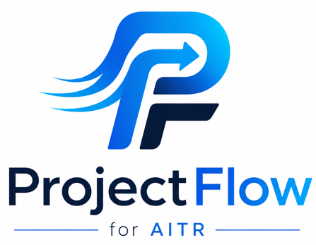

<p align="center">
  
</p>

<h1 align="center">ProjectFlow</h1>

<p align="center">
  <strong>AI-powered campus project management platform for students, mentors, HODs, admins, and super admins.</strong>
</p>

<p align="center">
  <a href="https://projectflow-edu-app.netlify.app"></a>
  
  
  
  
  
  
</p>

## Live Deployment

- **Frontend Live URL:** https://projectflow-edu-app.netlify.app
- **Current production host:** Netlify
- **Current production API path:** `/api/*` via Netlify Functions
- **Enterprise API foundation:** `/api/v2/*`

## Overview

ProjectFlow digitizes the complete campus project lifecycle: student account creation, project registration, team formation, HOD registration forms, approvals, mentor assignment, milestone tracking, document workflows, notifications, analytics, and real-time collaboration readiness.

The repository currently contains the active production React/Vite application plus a new enterprise-grade Next.js App Router workspace that is being built phase by phase.

## Latest Features Implemented

- Student signup/login with normalized email handling
- HOD, mentor, and student role-based routing
- JWT-protected backend APIs
- Forgot password API with real Nodemailer send flow
- Reset token storage with hashed tokens
- Production email diagnostics without logging secrets
- HOD project registration forms
- Student project registration and team member validation
- HOD approval/rejection and mentor assignment workflows
- Notifications and dashboard polling fallback
- Socket.IO-ready backend and frontend realtime plumbing
- Responsive auth UI restored and verified
- Prisma 7 enterprise schema foundation
- `/api/v2/auth` enterprise auth foundation
- Redis-backed session architecture foundation
- Audit log models and service foundation
- Next.js App Router enterprise workspace
- shadcn-style UI primitives for the enterprise workspace
- React Query and Zustand foundation for the enterprise workspace

## Tech Stack

### Active Frontend

- React 19
- Vite
- Tailwind CSS
- React Router
- Redux Toolkit
- Zustand
- TanStack Query
- TanStack Table
- React Hook Form
- Zod
- Framer Motion
- Recharts / ECharts
- Socket.IO Client
- Sentry-ready monitoring

### Enterprise Frontend Foundation

- Next.js App Router
- Tailwind CSS
- shadcn/ui-style primitives
- Framer Motion
- TanStack Table
- React Query
- Zustand
- Socket.IO Client
- React DnD
- Recharts

### Backend

- Node.js
- Express.js
- PostgreSQL
- Prisma ORM
- Redis / Upstash-ready session cache
- Socket.IO
- JWT authentication
- bcrypt password hashing
- Nodemailer email flows
- Express rate limiting
- Multer upload foundation

### Database

- PostgreSQL
- Neon-compatible connection via `DATABASE_URL`
- Prisma schema in `backend/prisma/schema.prisma`
- Existing SQL migrations and compatibility schemas in `database/`

## Authentication & Security

Current and enterprise auth capabilities include:

- JWT auth
- Role-based access control
- Student, Mentor, HOD, Admin, Super Admin role model
- Forgot password email flow
- Password reset token hashing
- Email verification foundation
- Refresh token and session model foundation
- Redis session cache foundation
- Account lockout foundation
- Login attempt tracking
- Audit logs for sensitive auth operations
- Rate limiting on auth routes

## Core Modules

### HOD Registration Forms

- HOD can create registration forms
- Forms can be published to students
- Students can view active HOD forms
- HOD can review student submissions
- HOD can approve/reject projects and assign mentors

### Student Project Registration

- Student profile and semester-aware registration
- Project form submission
- Team member email and roll number validation
- Duplicate prevention
- Project workspace foundation

### Real-Time Features

- Socket.IO server setup
- Project room join events
- Message event foundation
- Task update event foundation
- Frontend Socket.IO client setup
- Redis pub/sub planned for horizontal scaling

### Responsive UI

- Restored polished signup/login UI
- Responsive dashboard layout work
- Mobile-aware auth and dashboard routes
- Tailwind build verified with restored CSS pipeline

## AI Roadmap

Planned AI capabilities:

- AI project idea generator
- Abstract generator
- Problem statement improver
- Plagiarism/similarity checker
- Project health scoring
- AI reviewer
- Mentor recommendation engine

## Folder Structure

```text
ProjectFlow/
├── backend/
│   ├── prisma/
│   │   └── schema.prisma
│   ├── src/
│   │   ├── config/
│   │   ├── controllers/
│   │   ├── middleware/
│   │   ├── routes/
│   │   ├── services/
│   │   ├── utils/
│   │   ├── app.js
│   │   └── server.js
│   └── package.json
├── database/
│   ├── migrations/
│   └── *.sql
├── docs/
│   ├── enterprise-architecture.md
│   └── enterprise-deployment.md
├── frontend/
│   ├── src/
│   │   ├── components/
│   │   ├── context/
│   │   ├── hooks/
│   │   ├── layouts/
│   │   ├── lib/
│   │   ├── pages/
│   │   ├── store/
│   │   ├── App.jsx
│   │   └── main.jsx
│   └── package.json
├── next-app/
│   ├── src/app/
│   ├── src/components/
│   ├── src/hooks/
│   ├── src/lib/
│   ├── src/stores/
│   └── package.json
├── netlify.toml
└── README.md
```

## Screenshots

> Add production screenshots here as the UI stabilizes.

| Signup | Dashboard | HOD Forms |
| --- | --- | --- |
| `artifacts/signup-live-restored.png` | _Coming soon_ | _Coming soon_ |

## Environment Variables

Do not commit real secret values. Configure these in local `.env` files and deployment dashboards.

### Backend

```env
DATABASE_URL=
JWT_SECRET=
FRONTEND_URL=
SMTP_HOST=
SMTP_PORT=
SMTP_USER=
SMTP_PASS=
SMTP_FROM=
REDIS_URL=
UPSTASH_REDIS_REST_URL=
UPSTASH_REDIS_REST_TOKEN=
REDIS_HOST=
REDIS_PORT=
REDIS_PASSWORD=
ACCESS_TOKEN_TTL=15m
REFRESH_TOKEN_DAYS=30
AUTH_LOCKOUT_LIMIT=5
AUTH_LOCKOUT_MINUTES=15
```

### Active Frontend

```env
VITE_API_URL=
VITE_SENTRY_DSN=
```

### Enterprise Next.js Frontend

```env
NEXT_PUBLIC_API_URL=
```

## Installation

### Prerequisites

- Node.js 20+
- npm
- PostgreSQL / Neon
- Redis / Upstash for enterprise sessions and realtime scaling
- SMTP provider, for example Gmail with App Password

### Backend

```bash
cd backend
npm install
npm run prisma:generate
npm run dev
```

Backend local URL:

```text
http://localhost:5000
```

### Active Frontend

```bash
cd frontend
npm install
npm run dev
```

Frontend local URL:

```text
http://localhost:5173
```

### Enterprise Next.js Workspace

```bash
cd next-app
npm install
npm run dev
```

Next.js local URL:

```text
http://localhost:3000
```

## Build Commands

```bash
cd frontend
npm install
npm run build
```

```bash
cd backend
npm install
npx prisma validate
```

```bash
cd next-app
npm install
npm run build
```

## API Endpoints

### Current Production Auth

```text
POST /api/auth/register
POST /api/auth/login
POST /api/auth/forgot-password
GET  /api/auth/me
```

### Enterprise Auth Foundation

```text
POST /api/v2/auth/register
POST /api/v2/auth/login
POST /api/v2/auth/refresh
POST /api/v2/auth/logout
GET  /api/v2/auth/me
POST /api/v2/auth/forgot-password
POST /api/v2/auth/reset-password
POST /api/v2/auth/email-verification
POST /api/v2/auth/verify-email
```

### Project/HOD/Student Modules

```text
GET    /api/health
GET    /api/student/*
POST   /api/student/*
GET    /api/hod/*
POST   /api/hod/*
PATCH  /api/hod/*
GET    /api/mentor/*
POST   /api/mentor/*
GET    /api/workflow/*
POST   /api/workflow/*
GET    /api/notifications/*
PATCH  /api/notifications/*
```

## Deployment Guide

### Current Netlify Deployment

The active production app deploys from GitHub to Netlify.

```text
Frontend build command:
cd frontend && npm install --include=dev && npm run build && cd ../backend && npm install

Publish directory:
frontend/dist

Functions directory:
backend/netlify/functions
```

### Enterprise Target Deployment

- Next.js frontend: Vercel
- Express backend: Render, Railway, or AWS
- Database: Neon PostgreSQL
- Redis: Upstash Redis
- File storage: AWS S3 or Cloudinary

More details:

- `docs/enterprise-architecture.md`
- `docs/enterprise-deployment.md`

## Verification Checklist

- Live URL opens
- Login page loads
- Create account page loads
- Reset password page loads
- Student dashboard route loads after login
- HOD forms publish/show flow works with HOD credentials
- Mobile responsive layout checked
- Backend health check returns OK
- Frontend build passes
- Next.js enterprise build passes
- Prisma schema validates

## Known Operational Notes

- SMTP variables must be configured for reset-password emails to actually send.
- Gmail requires an App Password; a normal Gmail password will not work.
- `/api/v2/auth` requires Prisma migrations before use on a fresh database.
- Redis/Upstash variables are listed and the architecture is ready, but production Redis must be configured in hosting.

## License

MIT License

## Maintainer

Piyush Mishra
